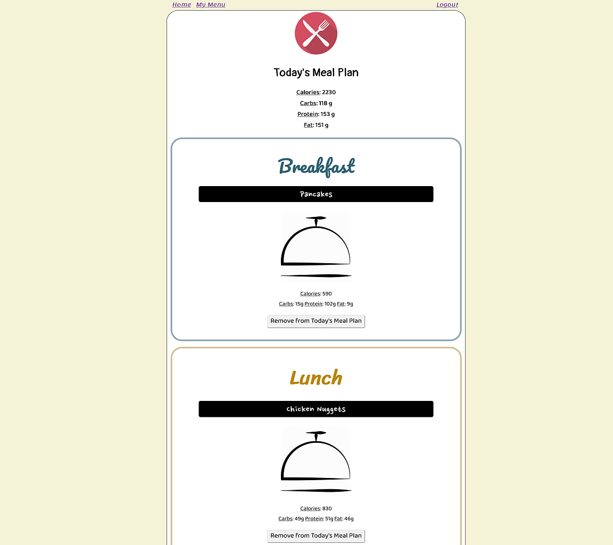
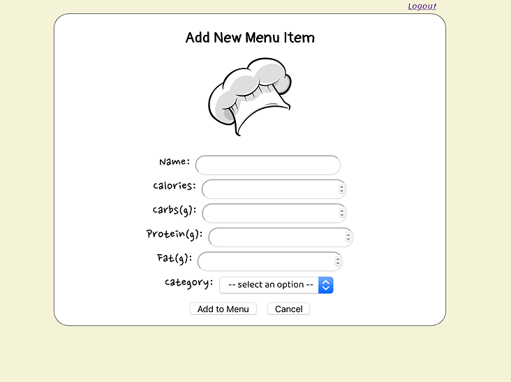

# My Nom Nom Menu & Meal Planner

Live App Link: <https://nom-nom-app.now.sh/>

# Screenshots
Landing Page:

Login Page:

Menu List Page:

Meal Plan Page:

Add Menu Item Page:

# Summary
  - This app allows you to create your own food menu & plan out what you want to eat for today.
    - Categories of the food menu include Breakfast, Lunch, and Dinner.
      - The user can add menu items to each category by providing the name of the food item and what category it belongs to.
      - Optional information that the user can include also includes an image url of the food and/or nutritional information such as calories, carbs, protein, and fat content.
    - Categories of the meal planner include Breakfast, Lunch, and Dinner.
      - The user can add/remove menu items from the menu to the meal planner as they please.
      - By including information such as calories, fat, protein, and carbs, the meal planner will show you the total nutritional information that you will be consuming for the day.

  - To get started the user must register for an account. After successful registration, all the user has to do is provide their username and password to log in and get started on their nom nom adventure!

- To see a demo version, see 'Demo Credentials' below and use the provided login information to login and try out some of the features of the app.

# Demo Credentials
Username: dunder_mifflin  
Password: Password1!

# Technologies Used

The following technologies were used to create this app:

* HTML
  - the language in which most websites are written. HTML is used to create pages and make them functional.

* JavaScript
  - a programming language that conforms to the ECMAScript specification.

* React
    - a JavaScript library for building user interfaces.  

* CSS
  - a simple mechanism for adding style (e.g., fonts, colors, spacing) to Web documents.
